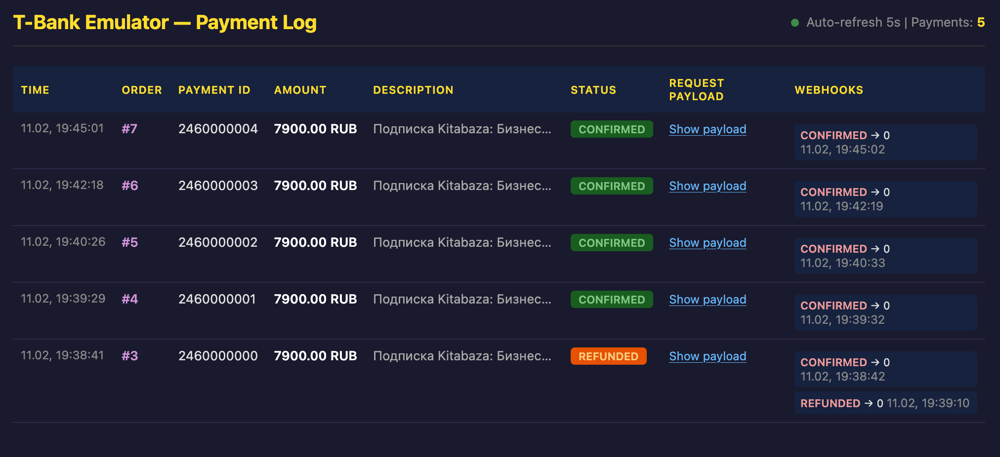
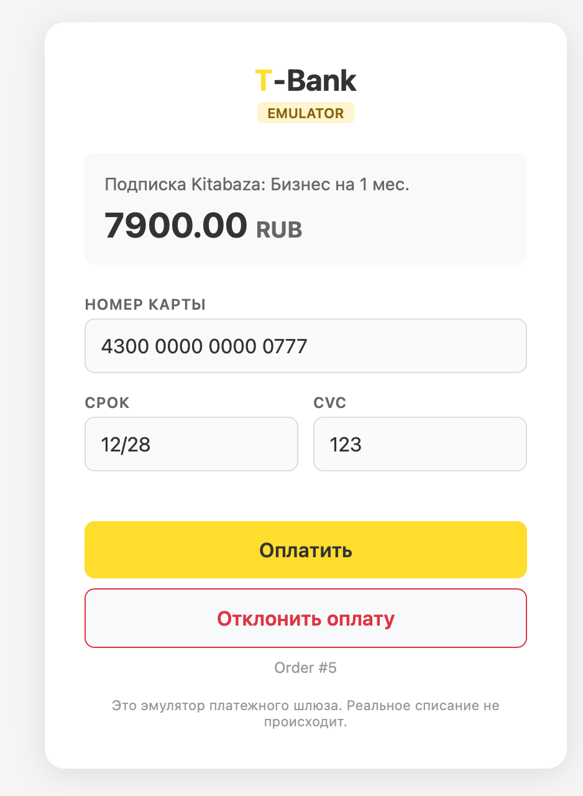

# TBank Gateway Emulator

Эмулятор платежного шлюза T-Bank (Тинькофф) для локальной разработки и тестирования.
Полностью повторяет API реального шлюза `securepay.tinkoff.ru/v2`, позволяя тестировать
платежный цикл без обращения к внешним сервисам.



## Возможности

- **Init** — создание платежа, генерация ссылки на страницу оплаты
- **GetState** — проверка текущего статуса платежа
- **Cancel** — возврат (в т.ч. частичный) подтверждённого платежа
- **Страница оплаты** — HTML-форма с кнопками «Оплатить» / «Отклонить» / «Недостаточно средств»
- **Webhook** — POST-уведомление на `NotificationURL` при смене статуса
- **Payment Log** — веб-интерфейс со списком всех платежей (автообновление 5 сек)
- **Token verification** — SHA-256 подпись запросов (алгоритм 1:1 с реальным T-Bank)



## Быстрый старт

### Docker

```bash
docker build -t tbank-gateway .
docker run -p 3000:3000 \
  -e TERMINAL_KEY=MyTerminal \
  -e PASSWORD=MyPassword \
  -e BASE_URL=http://localhost:3000 \
  tbank-gateway
```

### Node.js

```bash
npm install
TERMINAL_KEY=MyTerminal PASSWORD=MyPassword npm start
```

Сервис запустится на `http://localhost:3000`.

## Переменные окружения

| Переменная                | По умолчанию                | Описание                                                    |
|---------------------------|-----------------------------|-------------------------------------------------------------|
| `PORT`                    | `3000`                      | Порт сервера                                                |
| `TERMINAL_KEY`            | `TBankGatewayEmulatorLocal` | TerminalKey для верификации запросов                         |
| `PASSWORD`                | `emulator_secret_password`  | Password для генерации/проверки Token (SHA-256)              |
| `BASE_URL`                | `http://localhost:{PORT}`   | Публичный URL сервиса (для формирования PaymentURL)         |
| `WEBHOOK_DELAY_SECONDS`   | `3`                         | Искусственная задержка отправки webhook (в секундах)         |
| `WEBHOOK_DELAY_PERCENT`   | `50`                        | Процент успешных платежей, для которых применяется задержка  |

**Важно:** `TERMINAL_KEY` и `PASSWORD` должны совпадать с теми, что указаны в конфигурации клиента.

## API-документация (Scalar)

Интерактивная OpenAPI-документация по всем методам эмулятора: `GET /docs`.
Спецификация в машиночитаемом виде отдаётся по адресу `GET /openapi.yaml` —
её можно использовать как референс контракта T-Bank Acquiring API при интеграции
других проектов (запросы/ответы, алгоритм `Token`, коды ошибок, формат webhook).

## Документация для внешних агентов (llms.txt)

Помимо `/openapi.yaml`, эмулятор отдаёт документацию в формате [llms.txt](https://llmstxt.org/) —
удобном для чтения LLM-агентами других проектов без рендеринга Scalar UI:

- `GET /llms.txt` — краткий индекс: описание, алгоритм `Token`, ссылки, список методов
- `GET /llms-full.txt` — полная документация по всем операциям в Markdown

Оба файла генерируются из `openapi.yaml` скриптом `scripts/generate-llms-docs.js` —
автоматически при `npm install`/`npm ci` (хук `postinstall`), в том числе при сборке Docker-образа.
Сами файлы не хранятся в репозитории (см. `.gitignore`) — это сборочный артефакт, а не исходник.

## API

### POST /v2/Init

Создание платежа. Полный аналог `https://securepay.tinkoff.ru/v2/Init`.

**Request:**
```json
{
  "TerminalKey": "MyTerminal",
  "Amount": 10000,
  "OrderId": "123",
  "Description": "Подписка на 1 мес.",
  "PayType": "O",
  "SuccessURL": "https://example.com/success",
  "FailURL": "https://example.com/fail",
  "NotificationURL": "https://example.com/webhook",
  "Receipt": { "...": "..." },
  "Token": "<sha256>"
}
```

**Response (success):**
```json
{
  "Success": true,
  "ErrorCode": "0",
  "TerminalKey": "MyTerminal",
  "Status": "NEW",
  "PaymentId": "2460000000",
  "OrderId": "123",
  "Amount": 10000,
  "PaymentURL": "http://localhost:3000/payment/2460000000"
}
```

### POST /v2/GetState

Проверка статуса платежа.

**Request:**
```json
{
  "TerminalKey": "MyTerminal",
  "PaymentId": "2460000000",
  "Token": "<sha256>"
}
```

**Response:**
```json
{
  "Success": true,
  "ErrorCode": "0",
  "TerminalKey": "MyTerminal",
  "Status": "CONFIRMED",
  "PaymentId": "2460000000",
  "OrderId": "123",
  "Amount": 10000
}
```

### POST /v2/Cancel

Возврат платежа в статусе `CONFIRMED` или `PARTIAL_REFUNDED`. Поддерживает частичный возврат —
если `Amount` меньше оставшейся суммы платежа, статус становится `PARTIAL_REFUNDED` и возврат
можно повторить ещё раз на остаток. Если `Amount` не передан — возвращается вся оставшаяся сумма.

**Request (полный возврат):**
```json
{
  "TerminalKey": "MyTerminal",
  "PaymentId": "2460000000",
  "Token": "<sha256>"
}
```

**Response:**
```json
{
  "Success": true,
  "ErrorCode": "0",
  "TerminalKey": "MyTerminal",
  "Status": "REFUNDED",
  "PaymentId": "2460000000",
  "OrderId": "123",
  "OriginalAmount": 10000,
  "NewAmount": 0
}
```

**Request (частичный возврат, например 4000 из 10000):**
```json
{
  "TerminalKey": "MyTerminal",
  "PaymentId": "2460000000",
  "Amount": 4000,
  "Token": "<sha256>"
}
```

**Response:**
```json
{
  "Success": true,
  "ErrorCode": "0",
  "TerminalKey": "MyTerminal",
  "Status": "PARTIAL_REFUNDED",
  "PaymentId": "2460000000",
  "OrderId": "123",
  "OriginalAmount": 10000,
  "NewAmount": 6000
}
```

## Страница оплаты

`GET /payment/:paymentId` — HTML-страница с формой оплаты.

Содержит:
- Описание и сумму платежа
- Декоративные поля карты (предзаполненные, не валидируются)
- Кнопку **«Оплатить»** — переводит в `CONFIRMED`, отправляет webhook, редиректит на `SuccessURL`
- Кнопку **«Отклонить»** — переводит в `REJECTED`, отправляет webhook, редиректит на `FailURL`
- Кнопку **«Недостаточно средств»** — переводит в `REJECTED` с `ErrorCode: "51"`, эмулирует отказ банка по причине нехватки средств на карте, редиректит на `FailURL`

## Payment Log

`GET /log` — веб-интерфейс для мониторинга платежей в реальном времени.

Показывает таблицу всех платежей с полями:
- Время создания
- OrderId, PaymentId
- Сумма, описание
- Текущий статус (цветной бейдж)
- Полный request payload (раскрываемый)
- Список отправленных webhook-ов с их HTTP-статусами

Данные обновляются автоматически каждые 5 секунд.

**JSON API:** `GET /api/payments` — те же данные в формате JSON.

## Webhook

При смене статуса (оплата, отклонение, возврат) эмулятор отправляет POST на `NotificationURL`,
указанный при создании платежа.

**Payload:**
```json
{
  "TerminalKey": "MyTerminal",
  "OrderId": "123",
  "Success": true,
  "Status": "CONFIRMED",
  "PaymentId": "2460000000",
  "ErrorCode": "0",
  "Amount": 10000,
  "Pan": "430000******0777",
  "ExpDate": "1228",
  "CardId": "123456",
  "Token": "<sha256>"
}
```

Ожидаемый ответ: HTTP 200 с телом `OK`.

## Алгоритм Token (SHA-256)

Точная копия алгоритма T-Bank:

1. Берём только root-level scalar параметры (исключаем `Token`, массивы, объекты типа `Receipt`)
2. Добавляем `Password`
3. Сортируем по ключу (`ksort`)
4. Конкатенируем только значения (без ключей, без разделителей)
5. SHA-256 хеш

## Статусы платежей

| Статус      | Описание                            |
|-------------|-------------------------------------|
| `NEW`             | Создан, ожидает оплаты              |
| `CONFIRMED`       | Оплачен (кнопка «Оплатить»)        |
| `REJECTED`        | Отклонён (кнопка «Отклонить»)       |
| `PARTIAL_REFUNDED`| Возвращена часть суммы (через Cancel API) |
| `REFUNDED`        | Возвращён полностью (через Cancel API)    |

## Структура проекта

```
TBank-gateway/
├── Dockerfile
├── package.json
├── README.md
├── openapi.yaml            # Источник правды для /docs, /openapi.yaml, llms.txt
├── scripts/
│   └── generate-llms-docs.js  # Генерирует llms.txt/llms-full.txt из openapi.yaml
└── src/
    ├── app.js          # Express-сервер, все роуты
    ├── token.js         # Генерация/верификация SHA-256 токена
    ├── storage.js       # In-memory хранилище платежей и webhook-лог
    └── views/
        ├── payment.ejs  # Страница оплаты
        └── log.ejs      # Payment Log (мониторинг)
```

## Health Check

`GET /health` — возвращает `{ "status": "ok", "payments": <count> }`.

## Ограничения

- **In-memory хранилище** — данные теряются при перезапуске контейнера
- **Нет 3DS-эмуляции** — платёж переходит сразу в `CONFIRMED`/`REJECTED`
- **Нет двухстадийной оплаты** — `PayType: "T"` принимается, но не меняет поведение (нет `/v2/Confirm`)
- **Нет TTL/expiration** — платежи не истекают автоматически

## Лицензия

Проект распространяется под лицензией [MIT](LICENSE).

Это означает, что проект предоставляется «как есть» (as is), без каких-либо гарантий.
Вы можете свободно использовать, копировать, модифицировать и распространять его
в любых целях, включая коммерческие.
